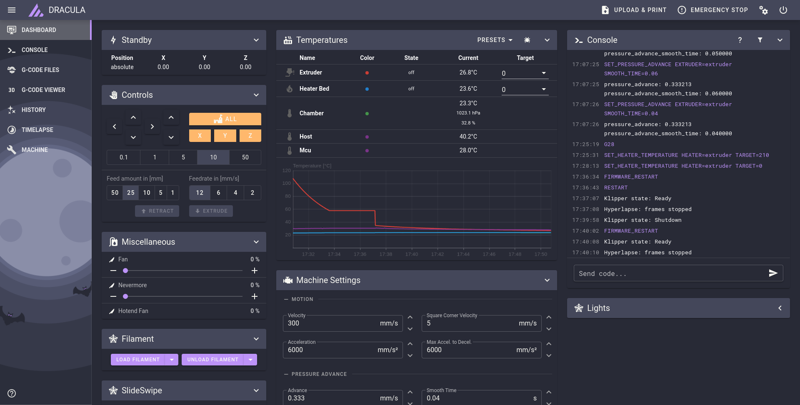

# Dracula for [Mainsail](https://docs.mainsail.xyz/)

> A dark theme for [Mainsail](https://docs.mainsail.xyz/).



## Install

### Install using Git

```
$ git clone https://github.com/steadyjaw/dracula-mainsail-theme.git 
$ cp -pr dracula-mainsail-theme/config/.theme ~/klipper_config/
```

## Team

This theme is maintained by the following person

[](https://github.com/steadyjaw) |
--- |
[Steadyjaw](https://github.com/https://github.com/steadyjaw) |

## License

[MIT License](./LICENSE)